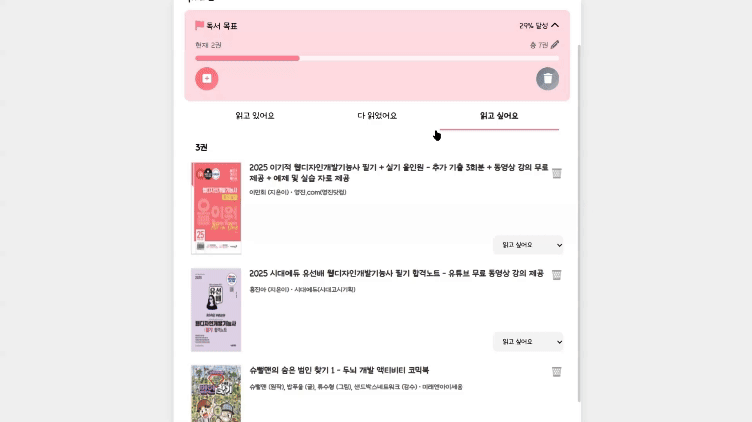

# 

**[URECA] Mini Project - 북적북적**  
**"독서 목표 설정 및 챌린지 달성 지원 웹사이트 구현을 통한 웹 아키텍처 이해"**  
이 프로젝트는 **사용자가 독서 목표를 설정하고, 진행을 추적하며, 책을 검색하는 기능을 제공하는 웹 아키텍처 구현 프로젝트입니다.**

---

## Overview

**독서 챌린지 트래커(BookTracker)** 는 사용자가 **독서 목표를 설정하고, 진행률을 추적하며, 원하는 책을 검색할 수 있는 웹 애플리케이션**입니다.  
책을 꾸준히 읽고 목표를 달성하는 **모티베이션을 제공**하는 것이 핵심 기능입니다.

### 개발 기간

**2025년 3월 13일 ~ 2025년 3월 21일 (총 1주일)**

---

## The Challenge

**사용자가 다음 기능을 수행할 수 있어야 합니다:**  
✔ **회원가입 & 로그인 (Token 기반 인증)**  
✔ **독서 목표 설정 및 진행률 확인**  
✔ **책 검색 기능 (알라딘 API 연동)**

---

## Screenshots

| 기능                      | 화면                                            | 설명                                                                        |
| ------------------------- | ----------------------------------------------- | --------------------------------------------------------------------------- |
| **회원가입**              |  | 사용자는 이메일과 비밀번호를 입력하여 회원가입할 수 있습니다.               |
| **로그인**                |   | 기존 계정으로 로그인하여 자신의 독서 목표 및 진행을 관리할 수 있습니다.     |
| **토큰 만료 시 로그아웃** |   | 로그인 토큰이 만료되면 자동으로 로그아웃되어 보안을 유지합니다.             |
| **홈 화면**               |    | 사용자의 현재 독서 목표 진행률과 책 목록을 한눈에 볼 수 있습니다.           |
| **도서 검색 기능**        |  | 알라딘 API를 활용하여 원하는 책을 검색할 수 있습니다.                       |
| **도서 추가 & 상태 변경** |  | 검색한 책을 독서 목록에 추가하고, 현재 읽고 있는 상태를 변경할 수 있습니다. |
| **도서 삭제**             |  | 추가된 책을 독서 목록에서 삭제할 수 있습니다.                               |
| **독서 목표 설정**        |    | 연간 독서 목표를 설정하고, 목표 도서 수를 조정할 수 있습니다.               |

---

## Features

### 회원가입 & 로그인

- **Token 기반 인증 (Session Storage 활용)**
- 이메일과 비밀번호를 통한 회원가입 및 로그인
- 로그인한 사용자만 자신의 독서 데이터에 접근 가능

### 독서 목표 설정 & 진행률 추적

- 연간 목표 도서 수 설정 가능 (예: 20권)
- 목표 정보는 `Goal` 테이블에 저장 (`email`, `target_books`, `current_books`, `is_completed` 등)
- **chart.js**를 활용하여 독서 진행률을 **실시간 시각화**하여 동기 부여 제공

#### 독서 상태 관리

- 독서 상태: **읽고 싶어요 → 읽고 있어요 → 다 읽었어요** 로 구분하여 상태 변경
- 독서 상태 변경 시 -> `Book` 테이블에 `status` update

### 도서 검색 및 추가 (알라딘 API)

- **알라딘 Open API 연동**
- 책 제목, 저자, ISBN 등을 기준으로 도서 검색 가능
- 검색 결과에서 원하는 책을 클릭하여 목록에 추가 가능
- 저장되는 정보: **책 제목, 저자, 출판사, 표지 이미지, 전체 페이지 수**
- 기본 상태는 **"읽고 싶어요"** 로 저장되며, 이후 상태 변경 가능

---

## Built With

| 구분             | 사용 기술                              |
| ---------------- | -------------------------------------- |
| **Frontend**     | HTML, CSS, JavaScript, Chart.js        |
| **Backend**      | Java (Spring), MyBatis (XML 방식), JSP |
| **Database**     | MySQL                                  |
| **API 연동**     | 알라딘 Open API                        |
| **Token**        | 토큰 기반 인증 (JWT 등)                |
| **3D 에셋 출처** | pixcap                                 |

---

# **Author**

👤 **양세현**  
**GitHub**: [@yshls](https://github.com/yshls)  
**Email**: shluxnsal01@gmail.com

👤 **황주경**  
**GitHub**: [@H-JuKyung](https://github.com/H-JuKyung)  
**Email**: hjk000hjk17@gmail.com

---

## GitHub Repository

- **Frontend:** [GitHub Repository 링크](https://github.com/yshls/BookTracker_Front)
- **Backend:** [GitHub Repository 링크](https://github.com/H-JuKyung/BookTracker_Back)

---

## 최종 정리

### 프로젝트 목적

- 사용자의 **독서 습관을 효율적으로 관리**하기 위한 웹 애플리케이션
- **도서 검색, 독서 목표 설정, 진행률 추적** 기능을 제공하여 **체계적인 독서 관리** 지원
- **직관적인 UI/UX**와 **시각적 데이터 제공 (차트 기반 진행률 표시)**
