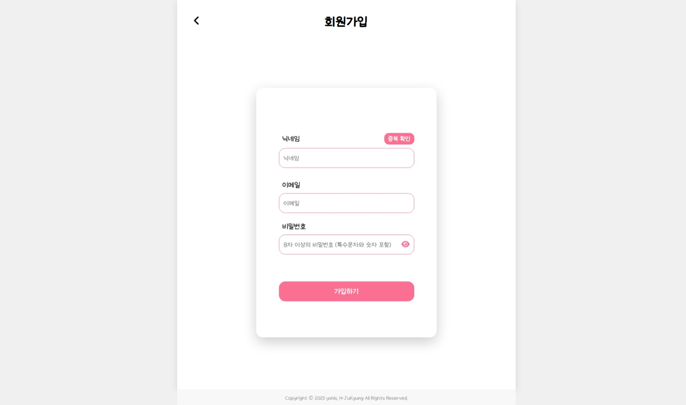
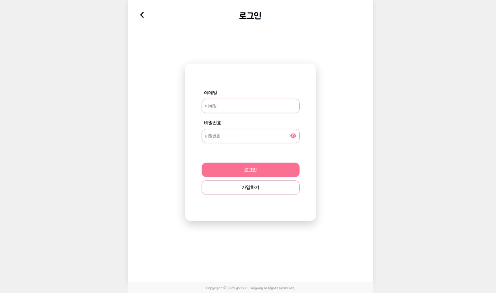
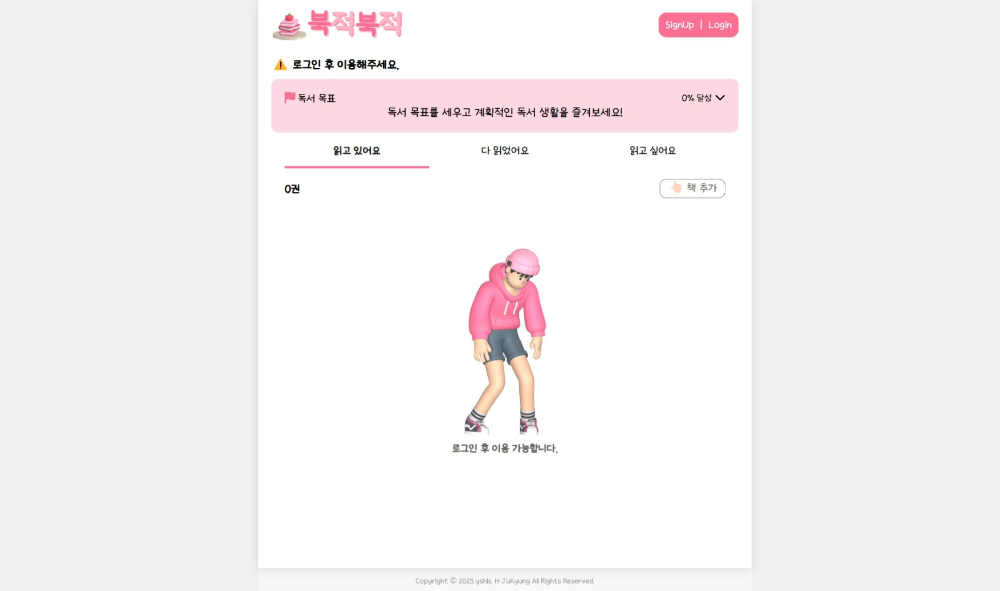
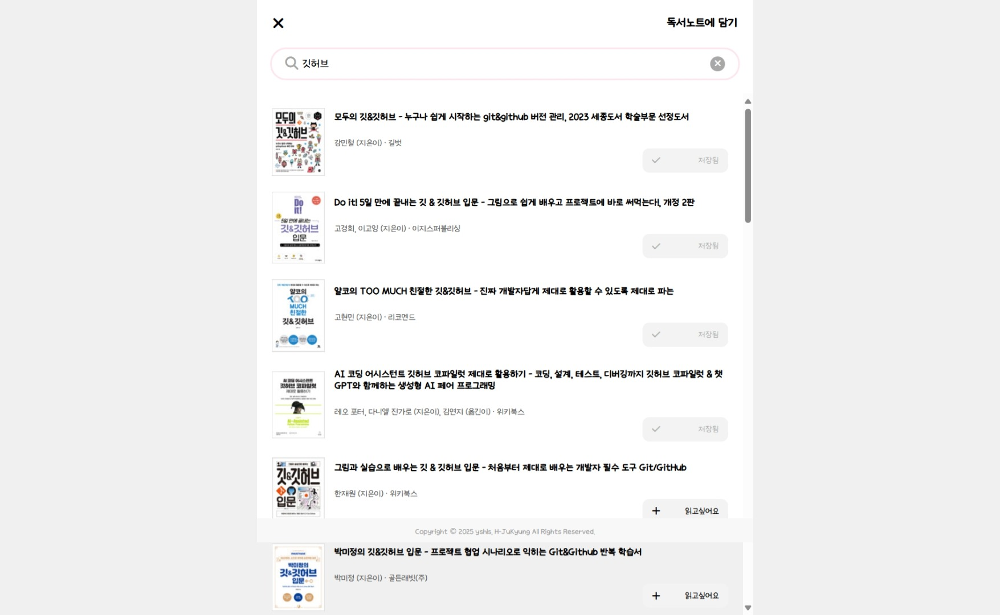

# 

**[URECA] Mini Project 1 - 양세현, 황주경**  
**"독서 목표 설정 및 챌린지 달성을 지원하는 웹사이트"**  
이 프로젝트는 **사용자가 독서 목표를 설정하고, 진행을 추적하며, 책을 검색하는 기능을 제공하는 웹 아키텍처 구현 프로젝트입니다.**

---

## 📌 **Table of Contents**

- [📌 Overview](#overview)
- [🎯 The Challenge](#the-challenge)
- [📸 Screenshots](#screenshots)
- [🚀 Live Demo](#live-demo)
- [🔥 Features](#features)
- [🛠 Built With](#built-with)
- [⚙️ Setup](#setup)
- [👨‍💻 Author](#author)
- [🔥 최종 정리](#최종-정리)

---

## **📌 Overview**

**독서 챌린지 트래커(BookTracker)**는 사용자가 **독서 목표를 설정하고, 진행률을 추적하며, 원하는 책을 검색할 수 있는 웹 애플리케이션**입니다.  
 책을 꾸준히 읽고 목표를 달성하는 **모티베이션을 제공**하는 것이 핵심 기능입니다.

---

## **🎯 The Challenge**

**사용자가 다음 기능을 수행할 수 있어야 합니다:**  
✔ **회원가입 & 로그인 (Session 기반 인증)**  
✔ **독서 목표 설정 및 진행률 확인**  
✔ **책 검색 기능 (알라딘 API 연동)**

---

## **📸 Screenshots**

| 기능                      | 화면                              |
| ------------------------- | --------------------------------- | --- |
| **회원가입**              |  |
| **로그인**                |       |
| **홈 화면**               |            |
| **도서 검색 기능**        |   |
| **도서 추가 & 상태 변경** | 
- **Backend:** [🔗 GitHub Repository 링크](https://github.com/H-JuKyung/BookTracker_Back)

---

## 🔥 주요 기능 (Features)

## 🔥 주요 기능 (Features)

### 1️⃣ 회원가입 & 로그인

- **Session 기반 인증 (세션 쿠키 활용)**
- 이메일과 비밀번호를 통한 회원가입 및 로그인
- 로그인한 사용자만 자신의 독서 데이터에 접근 가능

### 2️⃣ 독서 목표 설정 & 진행률 추적

- 연간 목표 도서 수 설정 가능 (예: 20권)
- 목표 정보는 `Challenge` 테이블에 저장 (`year`, `email`, `goal_count`, `completed_count` 등)
- 독서 상태: **읽고 싶어요 → 읽고 있어요 → 다 읽었어요** 로 구분하여 상태 변경 가능

#### 📖 진행률 관리

- **"읽고 있어요"** 상태로 변경 시 → `progress` 테이블에 `start_date`, `total_pages`, `pages_read` 저장
- 사용자가 페이지 수를 입력하면 진행률 자동 계산
- **"다 읽었어요"**로 변경 시 → `end_date` 기록 + Challenge 테이블의 완료 수 증가
- **chart.js**를 활용하여 독서 진행률을 **실시간 시각화**하여 동기 부여 제공

### 3️⃣ 도서 검색 및 추가 (알라딘 API)

- **알라딘 Open API 연동**
- 책 제목, 저자, ISBN 등을 기준으로 도서 검색 가능
- 검색 결과에서 원하는 책을 클릭하여 목록에 추가 가능
- 저장되는 정보: **책 제목, 저자, 출판사, 표지 이미지, 전체 페이지 수**
- 기본 상태는 **"읽고 싶어요"**로 저장되며, 이후 상태 변경 가능

---

## 🛠️ 기술 스택 (Tech Stack)

| 구분             | 사용 기술                              |
| ---------------- | -------------------------------------- |
| **Frontend**     | HTML, CSS, JavaScript, Chart.js        |
| **Backend**      | Java (Spring), MyBatis (XML 방식), JSP |
| **Database**     | MySQL                                  |
| **API 연동**     | 알라딘 Open API                        |
| **Session**      | Spring Session 기반 인증 처리          |
|                  |                                        |
| **3D 에셋 출처** | pixcap                                 |

---

# **👨‍💻 Author**

👤 **양세현**  
**GitHub**: [@yshls](https://github.com/yshls)  
**Email**: shluxnsal01@gmail.com

👤 **황주경**  
**GitHub**: [@H-JuKyung](https://github.com/H-JuKyung)  
**Email**: hjk000hjk17@gmail.com

---

## 🔥 최종 정리

### 프로젝트 목적

- 사용자의 **독서 습관을 효율적으로 관리**하기 위한 웹 애플리케이션
- **도서 검색, 독서 목표 설정, 진행률 추적** 기능을 제공하여 **체계적인 독서 관리** 지원
- **직관적인 UI/UX**와 **시각적 데이터 제공 (차트 기반 진행률 표시)**

---

### 주요 기능 요약

- **Session 기반 회원가입 & 로그인** (사용자별 데이터 관리)
- **알라딘 API 연동 도서 검색 기능**
- **연간 독서 목표 설정 및 진행률 시각화 (`chart.js`)**
- **도서 상태 관리 (읽고 싶어요 → 읽고 있어요 → 다 읽었어요)**
- **페이지 기반 독서 진행률 관리**
